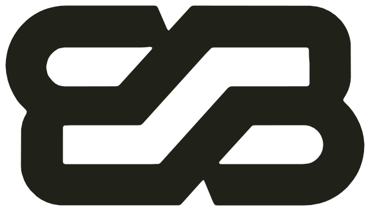

  

<h1 align="center">Hi there, I'm Elías 👋</h1>

<strong>Frontend Engineer · Based in New Zealand · Open to local opportunities</strong>

also known as <strong>Elibabah</strong>

  <a href="https://www.linkedin.com/in/elibabah/">LinkedIn</a> ·
  <a href="https://elibabah.com">elibabah.com</a> ·
  <a href="mailto:elias@elibabah.com">elias@elibabah.com</a>

---

### About

I'm a frontend engineer currently living in **New Zealand**. I build interfaces with a focus on craft, clarity, and maintainability; I care as much about the architecture of a component as about the experience it creates.

I am presently working remotely as a frontend engineer for **BBVA**, and I am actively open to frontend roles based in **New Zealand**. If you are hiring locally, I would be glad to talk.

I am also completing a **Master of Applied Management at the Southern Institute of Technology (SIT)**, which I will finish in December 2026. The degree has sharpened how I connect technical work to broader questions of strategy, value, and human practice.

Before software, I trained as a linguist and literary scholar. That shaped how I think: I read code the way I once read texts, attentive to structure, intention, and meaning. I believe good engineering, like good writing, is a matter of precision, rhythm, and care.

> *Homo sum, humani nihil a me alienum puto.* — Terence

---

### What I work with

**Core:** JavaScript · TypeScript · Web Components · Lit
**Frameworks:** React · Next.js
**Also:** HTML · CSS · Git · CI/CD · Node.js

I am currently deepening my work with React and Next.js, and exploring how AI is reshaping the practice of software development.

  

---

### Most used languages

  

---

  
<strong>Why "Elibabah"?</strong>

  
  Elías meets <em>Ali Baba</em>, from <em>One Thousand and One Nights.</em> In the tale, the right words open the cave; in code, the right words open everything else.
  

